# Codex iLink

把微信变成 Windows 本机 Codex 的轻量入口。微信与 Codex Desktop 使用同一份任务历史；Bridge 只负责控制路由、并发仲裁和可靠送达，不复制对话，也不创建第二个 Agent。

> 当前为开发预览版。文本链路、共享任务、权限/模型控制和媒体收发已实现；真实微信媒体、离开状态通知与长期后台运行仍需最终验收。

## 核心能力

- 在微信查看项目、进入或新建 Codex 任务
- 读取并更新当前共享任务的模型、推理强度和原生权限 Profile
- 通过 Codex App Server 恢复同一 `thread_id`，Desktop 可继续查看和操作
- 使用 SQLite 租约避免 Desktop 与微信同时写入同一任务
- 入站图片、文件、视频和微信语音转写；出站本机附件
- 同一任务 FIFO 串行、不同任务最多并行 3 个；消息去重、队列与回包均可恢复
- DPAPI 加密凭证，只接受已绑定的单一微信控制者

## 用户安装

### 兼容性

| 项目 | 要求 |
| --- | --- |
| 操作系统 | Windows |
| Node.js | 24 或更高版本 |
| Codex | 已登录 Codex Desktop，且 PowerShell 可运行 `codex --version` |
| Shell | PowerShell |

如果没有 `codex` 命令，先按官方方式安装：

```powershell
npm install --global @openai/codex
```

### 本地预览安装

本地源码安装额外需要 pnpm 11.7。

1. 在 GitHub 页面选择 **Code → Download ZIP**，解压到一个长期保留的目录。
2. 在该目录打开 PowerShell，依次执行：

```powershell
pnpm install --frozen-lockfile
pnpm build
npm install --global .
codex plugin marketplace add .
codex plugin add codex-ilink-probe@codex-ilink
ilink doctor
ilink login
ilink start
```

扫码绑定后，向机器人发送“查看项目”或 `p` 即可开始。插件安装或升级后，需要刷新 Codex Desktop，并审核、信任 `Codex iLink Guard` Hooks。

```powershell
ilink status   # 查看运行状态
ilink stop     # 停止后台 Bridge
ilink start    # 再次启动
```

当前版本尚未发布到 npm Registry。上面的本地全局安装会让 `ilink` 和插件引用解压目录，请勿移动或删除它。

### npm 安装（发布后）

首个公开版本将先使用 `next` 标签发布。npm 页面确认已经存在该版本后，再执行：

```powershell
npm install --global codex-ilink@next
$packageRoot = Join-Path (npm root --global) "codex-ilink"
codex plugin marketplace add $packageRoot
codex plugin add codex-ilink-probe@codex-ilink
ilink doctor
ilink login
ilink start
```

不要在 npm 尚未发布时执行上述安装命令，也不要从非官方 Registry 安装同名包。

早期本地预览版曾使用 marketplace 名称 `personal`。升级前先执行
`codex plugin remove codex-ilink-probe@personal`；再用
`codex plugin marketplace list` 确认 `personal` 是否只属于本项目。只有确认没有承载其他插件时，才移除该 marketplace，避免误删用户自己的配置。

### 升级与卸载

升级预览版：

```powershell
ilink stop
npm install --global codex-ilink@next
codex plugin remove codex-ilink-probe@codex-ilink
codex plugin add codex-ilink-probe@codex-ilink
ilink doctor
ilink start
```

卸载程序和插件：

```powershell
ilink stop
codex plugin remove codex-ilink-probe@codex-ilink
codex plugin marketplace remove codex-ilink
npm uninstall --global codex-ilink
```

卸载不会自动删除 `%LOCALAPPDATA%\Codex_iLink` 中的绑定、状态和日志。确认不再需要后再手动清理该目录。

### 源码开发

额外要求：pnpm 11.7。

```powershell
pnpm install --frozen-lockfile
pnpm typecheck
pnpm test
pnpm ilink doctor
```

Bridge 在当前 Windows 用户会话中后台运行，日志位于 `%LOCALAPPDATA%\Codex_iLink\logs\bridge.log`。当前版本不会自动注册开机启动。

### 超时配置

默认会话绑定超时为 30 分钟，未锁屏时连续 5 分钟无键鼠输入会判定为离开。可在 Bridge 运行时修改，设置会立即生效：

```powershell
ilink config
ilink config set session-timeout 60m
ilink config set away-timeout 10m
ilink config reset
```

会话绑定范围为 5～1440 分钟，离开判定范围为 1～60 分钟。锁屏一经检测会立即判定离开，不受 `away-timeout` 影响。会话绑定超时或主动 `exit` 只改变后续消息路由，原会话和运行中的任务仍会保留；Bridge 会向微信发送一次明确提醒。

### 常见排查

```powershell
node --version
codex --version
codex plugin list
ilink doctor
ilink status
```

优先查看 `ilink doctor` 的稳定错误码和 `%LOCALAPPDATA%\Codex_iLink\logs\bridge.log`。插件安装或升级后需要刷新 Codex Desktop，并重新审核 Hooks；不要把 npm 密码、OTP、恢复码或本机凭证发到聊天中。

## 微信控制

| 功能 | 短命令 | 自然语言示例 |
| --- | --- | --- |
| 项目 | `p`、`p<n>` | “查看项目”“切换到第二个项目” |
| 任务 | `s`、`s+`、`sarc`、`s<n>` | “最近任务”“打开第 3 个会话” |
| 新建/清理 | `new`、`clear`、`compact` | “新建任务”“清空上下文”“压缩上下文” |
| 停止/退出 | `stop`、`exit` | “停止当前微信回合”“返回主会话” |
| 状态 | `st` | “查看当前状态” |
| 权限 | `perm`、`perm<n>` | “查看权限”“切换到第三个权限” |
| 模型 | `model`、`model<n>`、`model:<id>` | “把当前任务模型换成 Sol” |
| 推理强度 | `effort`、`effort<n>`、`effort:<level>` | “推理强度调到 xhigh” |
| 审批 | `ok[code]`、`no[code]` | “批准当前审批”“拒绝审批 A7C9E2” |
| 帮助 | `help` | “查看命令列表” |

短命令不带 `/`，也不在命令和编号之间加空格。`p<n>`、`s<n>` 没有有效列表快照时，会按当前项目列表或当前项目第一页解释；显式列表产生的编号固定 10 分钟，进入任务后的绑定按 `session-timeout` 滑动保持，默认 30 分钟。

一条消息可包含最多 4 个明确控制动作，例如“返回主会话，然后查看状态”。Bridge 按原顺序执行、遇到失败立即停止，并只发送一条汇总回复。

### 混合路由

1. 精确短命令直接执行。
2. 明确且无歧义的中文由本地规则解析。
3. 仍疑似控制请求的文本交给独立、临时的 Codex 工具回合分类。
4. 只有通过白名单校验的结构化 Intent 才执行；其余文本进入原业务任务。

分类回合不读取或写入业务任务历史，控制 Prompt 也不会注入 Desktop 的共享任务。项目约定仍应放在官方支持的 `AGENTS.md`，模型、Sandbox、审批和 MCP 等持久设置仍由 `config.toml` 或 Codex 原生权限 Profile 管理。

## 架构与流程

### 系统架构



Codex 持久化任务是唯一历史事实源。微信与 Desktop 使用同一个 `thread_id` 继续任务；Bridge 只承担传输、路由、并发仲裁和可靠送达。

### 消息调度


同一 `thread_id` 一次只运行一个回合，后续消息进入持久 FIFO 队列；不同任务可以并行，Bridge 全局最多同时执行 3 个微信回合。切换会话只改变后续消息的目标，不影响已经运行或排队的任务。

图表由 [Archify](https://github.com/tt-a1i/archify) 生成，支持深浅色主题；可交互版本和源文件位于 [`docs/diagrams`](./docs/diagrams)。

## 行为边界

- `stop` 只中断当前会话中由微信发起的活动回合；Desktop 发起的回合需在 Desktop 停止。
- `exit` 返回持久化的微信主任务，不重建任务，也不改写模型和权限。
- `model`、`effort` 和 `perm` 修改当前共享任务，Desktop 中同一任务同步生效；不会修改其他任务或全局默认值。
- `clear` 新建空白任务，原历史仍可通过 `s` 找回；`compact` 使用 Codex 原生上下文压缩。
- SQLite 只保存路由、租约和送达状态，不保存完整对话；Codex 持久化任务是事实源。
- 项目列表只读取 Codex Desktop 已保存工作区，不扫描全部历史目录。

## 媒体

- 图片下载解密后作为 App Server `localImage` 输入。
- 文件和视频作为本地 `mention` 及明确路径提交，仍受任务 Sandbox 与审批策略约束。
- 有微信转写的语音按文本提交；没有转写时明确拒绝，不伪装成本地语音识别。
- 新任务通过 `send_file(path)` 发送本机图片、视频或普通附件；单文件不超过 100 MiB，单次最多 2 个。

媒体协议以腾讯官方 [`Tencent/openclaw-weixin`](https://github.com/Tencent/openclaw-weixin) `v2.4.6` 的固定提交 [`cef0bfc`](https://github.com/Tencent/openclaw-weixin/commit/cef0bfc390393f716903e16d50408118047f87e0) 为基线。

## 设计依据

- [Codex App Server](https://learn.chatgpt.com/docs/app-server.md)：官方面向深度集成的本地接口，提供任务历史、审批和流式事件。
- [AGENTS.md](https://learn.chatgpt.com/docs/agent-configuration/agents-md)：仓库内持久指令的官方入口。
- [Codex configuration](https://learn.chatgpt.com/docs/config-file/config-basic)：CLI、IDE 与 Desktop 共享的配置层。

详细实现、失败语义与验证证据见 [SPEC.md](./SPEC.md)、[可行性说明](./docs/feasibility.md) 和 [ADR](./docs/adr)。

## 开发验证

```powershell
pnpm typecheck
pnpm test
```

`pnpm probe:lease` 与 `pnpm probe:resume` 会创建真实 Codex 任务并产生模型用量，不属于普通安装流程。

npm 维护者流程、首次发布的人工作业和 tarball 验收步骤见 [npm 发布流程](./docs/npm-publishing.md)。当前源码许可证标记为 `UNLICENSED`；在负责人明确选择许可证并补齐公开仓库信息前，不得发布到 npm。
