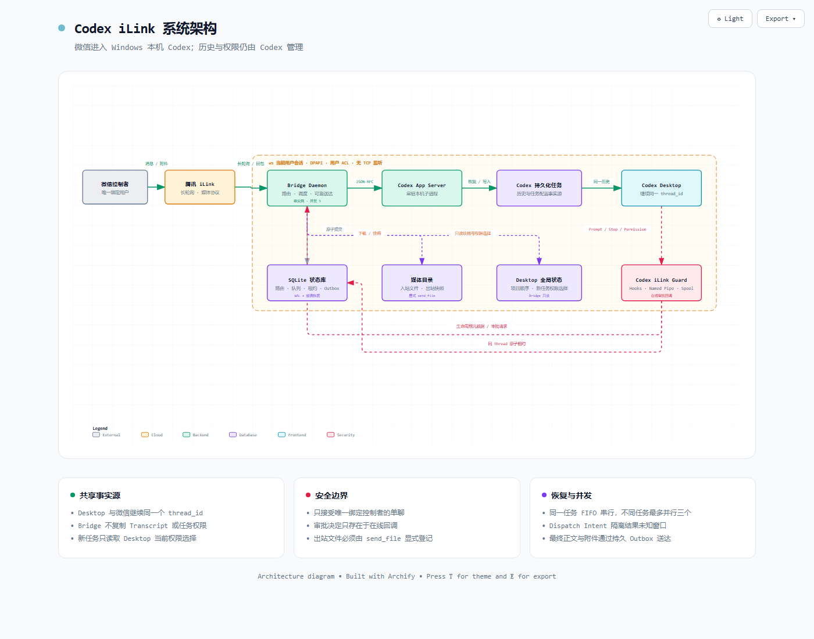

# Codex iLink

[](https://github.com/Obito-404/Codex_iLink/actions/workflows/ci.yml)
[](https://github.com/Obito-404/Codex_iLink/releases)
[](https://www.npmjs.com/package/codex-ilink)
[](#平台与要求)
[](./LICENSE)

Codex iLink 让你在微信里继续使用 Windows 电脑上的 Codex。

选择项目后，你可以新建任务，也可以继续 Codex Desktop 里的已有任务。微信与 Desktop 使用同一个 `thread_id`，看到的是同一份历史，不是两套相互复制的对话。

- 在微信发送文字、图片、文件或视频，并接收 Codex 生成的文件。
- 锁屏、关闭显示器或离开电脑后，本机任务仍可继续执行。
- 使用“替我审批”时，Codex 自己处理可自动审核的操作；只有真正等待用户决定的请求才会发送微信审批。
- Bridge 持久化路由、队列和待发送结果，不保存第二份完整聊天记录。

> [!WARNING]
> 当前版本仍在预览阶段，只支持 Windows 10/11 x64。请安装 npm `next` 通道；电脑关机、休眠、断网或退出当前 Windows 用户后，本机任务无法继续。



[下载后本地打开交互式架构图](./docs/diagrams/codex-ilink-architecture.html) · [查看完整消息时序](./docs/assets/codex-ilink-message-flow.png)

## 平台与要求

| 平台 | 状态 |
| --- | --- |
| Windows 10/11 x64 | 预览支持 |
| Windows on Arm | 暂不支持 |
| macOS Intel / Apple 芯片 | 暂不支持 |
| Linux | 暂不支持 |

| 依赖 | 要求 |
| --- | --- |
| Codex | 已安装并登录 Codex Desktop，最低 `0.144.2` |
| Node.js | `>=22.13.0`，支持 Node.js 22 LTS 系列 |
| 终端 | PowerShell |

Codex `0.144.x` 已通过兼容性验证。更高版本可以试用，`ilink doctor` 会提示“尚未验证”；低于 `0.144.2` 不受支持。

## 快速开始

### 1. 安装预览版

```powershell
node --version
npm install --global codex-ilink@next
ilink setup
```

`ilink setup` 会安装或更新 `Codex iLink Guard`、打开微信二维码、注册当前用户的登录启动任务，并启动后台 Bridge。

### 2. 信任 Hooks

Codex 要求用户审核非托管命令 Hook。安装完成后：

1. 刷新或重启 Codex Desktop。
2. 打开 Hooks 信任页面；使用 Codex CLI 时也可以输入 `/hooks`。
3. 找到内部 ID 为 `codex-ilink-probe`、显示名为 `Codex iLink Guard` 的插件。
4. 检查来源和命令后，信任该插件需要的 Hooks。

`ilink setup` 不修改 Codex 的信任存储，也不会使用危险参数绕过审核。Hook 定义发生变化时，Codex 可能要求重新确认。

### 3. 验证并开始使用

```powershell
ilink doctor
ilink status
```

向已绑定的微信机器人发送：

```text
查看项目
```

也可以发送短命令 `p`。收到项目列表后即可选择项目和任务。

## 工作方式

1. Bridge 从腾讯 iLink 长轮询接收唯一绑定控制者的消息，并在同一事务中完成去重、路由和游标推进。
2. 微信回合通过常驻 Codex App Server 恢复或创建持久化任务；已有任务继承 Codex 保存的历史、模型、工作目录和权限。
3. `Codex iLink Guard` 用 Hooks 和当前用户 Named Pipe 感知 Desktop 生命周期，并与 Bridge 按 `thread_id` 竞争原子租约，避免同一任务并发写入。
4. 最终正文和显式登记的附件一起进入 Outbox；网络失败可以重试，提交结果未知的输入不会自动重跑。

同一任务严格 FIFO 串行，不同任务最多并行三个微信回合。详细边界见 [系统规格](./SPEC.md) 和 [消息执行时序](./docs/assets/codex-ilink-message-flow.png)。

## 使用与维护

完整说明集中在 [用户指南](./docs/user-guide.md)：

| 内容 | 入口 |
| --- | --- |
| 管理命令、升级与启动项 | [日常管理](./docs/user-guide.md#日常管理) |
| 微信短命令 | [微信命令](./docs/user-guide.md#微信命令) |
| 图片、文件、视频与出站附件 | [图片和文件](./docs/user-guide.md#图片和文件) |
| 新任务权限与超时 | [权限与超时](./docs/user-guide.md#权限与超时) |
| 常见故障 | [故障排查](./docs/user-guide.md#故障排查) |
| 卸载 | [卸载](./docs/user-guide.md#卸载) |

## 安全与隐私

- 只接受扫码绑定的单一微信控制者发来的单聊。
- iLink Token 使用 Windows DPAPI CurrentUser 加密；状态目录使用当前用户 ACL。
- 插件和 Bridge 使用 Windows Named Pipe，不开放 TCP 监听端口。
- Codex 是对话和权限的事实源；Bridge 不保存完整 Transcript，也不保存可回灌的任务权限快照。
- 本机文件只有通过 `send_file` 明确登记、且位于当前任务目录内时才能发往微信。

默认没有外部遥测。日志不记录消息正文、Token、二维码、完整对话、媒体密钥或完整本机路径。安全漏洞请按 [安全政策](./SECURITY.md) 私下报告。

## 源码开发

源码开发最低需要 Node.js 22.13；CI 与独立版发布固定使用 Node.js 22.23.1 和 pnpm 11.7。

```powershell
git clone https://github.com/Obito-404/Codex_iLink.git
cd Codex_iLink
corepack pnpm install --frozen-lockfile
npm run typecheck
npm test
npm run build:sea
```

`build:sea` 只在 Windows x64 上构建，并在 `artifacts/` 生成独立 exe 与 SHA-256 文件。

## 文档与反馈

- [用户指南](./docs/user-guide.md)
- [系统规格](./SPEC.md)
- [架构决策记录](./docs/adr)
- [可行性说明](./docs/feasibility.md)
- [正式发布验收清单](./docs/release-acceptance.md)
- [发布与分发流程](./docs/npm-publishing.md)

普通 Bug 和功能建议请提交到 [GitHub Issues](https://github.com/Obito-404/Codex_iLink/issues)。提交日志、截图或复现信息前，请先移除 Token、二维码、微信标识和本机路径。

本项目采用 [MIT License](./LICENSE)。
