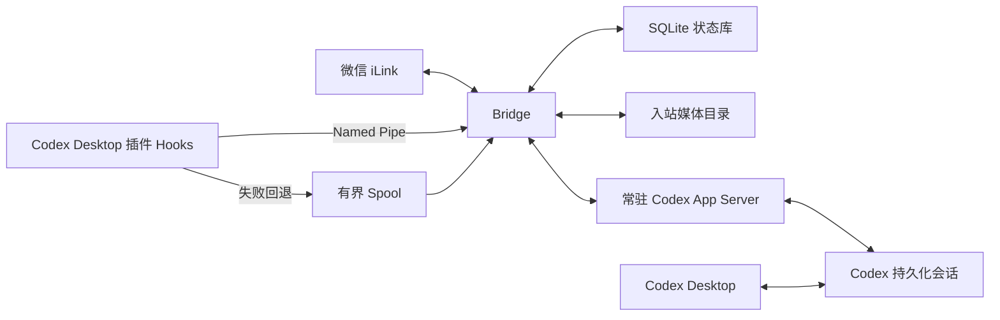

# Codex iLink 规格

设计状态：已确认  
实现状态：核心模块及真实微信文本收发已验证；微信入站媒体与本地附件出站链路已实现，真实微信媒体、离开状态主动推送与最终实机抢占仍待验收  
日期：2026-07-18

## 1. 目标

把微信作为 Windows 本机 Codex 的另一个入口。用户可以浏览项目和会话、进入或新建会话、继续对话、接收离开电脑后的任务通知，并在 Codex Desktop 中看到同一份会话历史。

系统不是第二个 Agent，也不复制 Codex 对话。Codex 持久化会话是对话事实源；Bridge 只负责传输、路由、状态和可靠执行。

## 2. 已验证事实

- 自定义 App Server 可以创建持久化 Codex 会话，Desktop 可以检索和读取。
- 已在当前 `D:\Codex_iLink` 目录通过 App Server 新建并完成任务 `019f664b-3baa-7183-9159-27256b164cb5`；任务名、微信侧测试消息和最终回复均出现在 Desktop 最近任务中。外部写入后 Desktop 列表可能需要一次打开或刷新才更新，但持久化历史可立即按 `thread_id` 读取。
- 新 App Server 进程可以按同一 `thread_id` 恢复会话并写入新回合，Desktop 能读取新增消息和结果。
- 同一任务的持久化继续记录可由 Desktop 任务记录读取，不需要 Bridge 复制 Transcript。
- 插件内部 ID 为 `codex-ilink-probe`，显示名为 `Codex iLink Guard`；Codex Desktop 的 Hook 信任页显示内部 ID。
- PATH 中的 `codex-cli 0.144.4` 与 Desktop 内置 Codex `0.144.2` 均已实测：插件 Hook 可捕获真实 `session_id`、`turn_id` 和 `cwd`，该 `session_id` 可被对应 App Server 的 `thread/resume` 恢复。新版生产 Hook 经人工信任后，也已在 Desktop 既有任务的继续回合中真实捕获 `SessionStart`、`UserPromptSubmit` 和 `Stop`。
- 两个运行时的 `thread/resume` 均返回会话的模型、工作目录、审批策略和 Sandbox；只传 `threadId`、不传任何覆盖值时可以继承这些已持久化配置。
- App Server 会产生 `thread/status/changed`、`turn/started` 和 `turn/completed` 事件。
- 独立 App Server 不能可靠订阅另一个 Desktop 进程正在执行的实时事件，因此 Desktop 插件 Hooks 负责 Desktop 生命周期感知。
- 当前版本生成的 App Server Schema 包含 `thread/list`、`thread/read`、`thread/resume`、`thread/unarchive`、`thread/name/set` 和 `turn/start`，没有 `project/list`。
- 当前 Codex Desktop 的 `%USERPROFILE%\.codex\.codex-global-state.json` 中，`electron-saved-workspace-roots` 精确表示已保存项目集合，`project-order` 表示 Desktop 展示顺序；本机 6 个项目已逐项核对一致。
- `PermissionRequest` Hook 技术上支持返回 `allow` 或 `deny`；V1 出于安全边界不启用微信审批 Desktop 回合，Hook stdout 始终为空，Desktop 审批仍由 Desktop 自己处理。
- Windows `GetLastInputInfo` 已在本机验证可读取键鼠空闲时间。
- 腾讯维护的 iLink/OpenClaw 微信插件源码提供扫码、文本收发、`message_id`、`get_updates_buf` 长轮询游标和 `context_token`；本机已完成真实扫码绑定、无上下文主动测试消息、微信文本入站及 `/st` 回复验收。真实 `message_id` 为超出 JavaScript 安全整数的 64 位数字，Bridge 已在原始 JSON 解析阶段无损保留并以精确字符串去重。
- 入站媒体 wire、CDN 下载和 AES 行为以腾讯官方 [`Tencent/openclaw-weixin`](https://github.com/Tencent/openclaw-weixin) `v2.4.6` 的固定提交 [`cef0bfc390393f716903e16d50408118047f87e0`](https://github.com/Tencent/openclaw-weixin/commit/cef0bfc390393f716903e16d50408118047f87e0) 为参考基线；该版本的 SILK → WAV 是转码，不是语音识别。
- 当前稳定 Codex App Server 的 `turn/start.input` 支持 `localImage` 和本地 `mention`，不支持通用 audio、video 或 binary 输入；因此图片可原生提交，文件和视频使用 `mention` 并附带明确的本机路径上下文，无转写语音不能直接进入现有回合协议。
- Codex 官方 Remote 已能从 ChatGPT 手机端继续同一台主机的任务、审批和接收通知，但它不是微信入口，而且要求 Desktop 主机保持可用。

## 3. 架构

### 3.1 Desktop 插件

- 打包 `SessionStart`、`UserPromptSubmit`、`Stop` 和 `PermissionRequest` Hooks。
- Hook 只发送 `session_id`、`turn_id`、`cwd`、事件名、模型和权限模式等元数据，不发送完整 Transcript。
- Hook 优先通过当前用户专属 Named Pipe 通知 Bridge；Pipe 不可用时把同一份元数据写入有界本地 Spool，Bridge 在启动及每轮运行期轮询中 single-flight 排空。`UserPromptSubmit` 不在门禁判定前发送生命周期事件；只有当前微信所选项目或已受管任务的 Prompt 需要 observation、但因 SQLite 瞬时写锁无法直接入库时，门禁 Hook 才写入带受控来源标记的 Spool。其他 Desktop 项目立即 fail-open，不记录活动观察或门禁 Spool；其 Stop 完成事件仍通过独立的 fail-open 生命周期通道进入 Pipe 或 Spool，用于离开通知。未匹配受管任务的 Stop 仅在 `thread/read` 确认来源为 Desktop（当前为 `source=vscode`）后通知，CLI 来源只保留防迟到 Prompt 的 tombstone。Bridge 在 iLink 长轮询返回后及每条已接受微信消息执行前排空，避免同批 `/s <n>` 与正文越过该观察。
- 生命周期通知的 Pipe、Spool 合计等待上限 500ms；两者都失败时放行，不阻塞 Desktop。`UserPromptSubmit` 的共享会话写入仲裁是安全边界，不使用这条 fail-open 路径。
- `PermissionRequest` 只用于通知 Desktop 审批状态。虽然 Hook 协议支持返回 `allow` 或 `deny`，V1 的 Hook 脚本始终保持 stdout 为空，不把微信接入 Desktop 审批决定链路。
- Bridge 启动的 App Server 带受控来源标记，Hook 据此区分 Bridge 回合和其他本机 Codex 回合，避免重复通知。
- 插件通过个人本地 Marketplace 安装，内部 ID 为 `codex-ilink-probe`，显示名为 `Codex iLink Guard`；首次安装和变更后由用户在显示内部 ID 的信任页审核并信任 Hooks。

### 3.2 Bridge

- 在当前 Windows 用户登录后由任务计划程序静默启动，不安装系统级 Service。
- 采用每用户单实例 Mutex，只允许一个 iLink 长轮询消费者。
- 独立于 Desktop 窗口运行；Desktop 关闭后微信入口仍可工作。
- 维护一个常驻 Codex App Server 子进程，异常退出后重启并对账。
- 每 60 秒使用公开 `thread/list`、`thread/read` 对已知会话状态进行轻量对账。对账修复状态缓存，但不伪造无法证明来源的完成通知。
- 通过 Windows 会话切换事件和 `GetLastInputInfo` 计算在场状态。
- 存在活动 Codex 回合时临时阻止系统睡眠，但允许锁屏和关闭显示器；全部完成后恢复原电源行为。

### 3.3 App Server

- 所有微信回合由同一个常驻 App Server 执行。Bridge 不覆盖 Codex 的功能开关、插件配置或项目/全局默认值，也不拼装自定义 Sandbox；工具是否可用和最终权限判定仍由 Codex 根据当前共享会话与用户配置完成。
- 进入既有会话时按 `thread_id` 调用 `thread/resume`。没有用户明确选择的会话级覆盖时，不覆盖模型、reasoning effort、目录、权限 Profile、审批者、审批策略或 Sandbox；存在 Bridge 已保存的明确选择时，只恢复对应字段。
- 仅在控制者显式发送 `model<n>`、`model:<id>`、`effort<n>`、`effort:<level>` 或 `perm<n>` 时，通过 Codex 列表接口校验当前账号实际可用的选项，再用 `thread/settings/update` 修改当前共享会话的后续回合；不修改项目或全局默认值。
- 三个内置权限模式绑定完整会话组合：`:read-only` 与 `:workspace` 使用 `approvalPolicy=on-request`、`approvalsReviewer=user`，`:danger-full-access` 使用 `approvalPolicy=never`、`approvalsReviewer=user`。完全访问在控制者明确选择后直接生效；自定义 Profile 只传 Profile ID，不推断审批策略。
- 权限更新后重新 `thread/resume` 并校验实际 Profile、审批策略和审批人。Bridge 持久化该明确选择供重连恢复；旧版只含 Profile ID 的记录不补写审批字段，避免静默扩权。
- `/new` 使用当前 Codex 运行时默认配置；选择项目时只显式设置该项目的 `cwd`，不假设存在公开的“Desktop 项目默认模型”。
- 微信主会话和无项目 `/new` 使用专用空白 Inbox 工作目录；微信产品上标记为“无项目”，但底层仍有合法 `cwd`，Desktop 可能按该物理路径分组显示。
- Bridge 对自己发起的同一会话回合严格串行；若租约或 Desktop 活动观察显示目标任务正在执行，则消息排队。
- Codex `0.144.4` 已实测不会拒绝两个独立 App Server 对同一 `thread_id` 的并发 `turn/start`，而且会造成历史回合错组。因此不能依赖 `idle` 预检或 Codex `Busy`。
- 微信主任务、当前绑定任务及仍有微信工作的任务中，Desktop `UserPromptSubmit` Hook 与 Bridge 在回合开始前必须竞争同一个按 `thread_id` 命名的原子租约；Desktop 通过 Hook 获得租约后才继续，Bridge 获得租约后才调用 `turn/start`。失败方阻止或排队，不进入 Codex。
- 当前微信所选项目中尚未受管的 Desktop 任务不参与门禁并始终放行，只在同一 SQLite 写序列中记录最小活动 turn 观察。若之后通过 `/s <n>` 进入该任务，微信回合会等待观察到精确 `Stop` 且对应 turn 可读为终态；该观察不进入 `/st` 活动任务，也不触发系统保活。其他 Desktop 项目始终放行且不记录活动观察；全项目 Stop 只用于离开通知，不改变项目选择或并发门禁。
- App Server 的 `thread/read` 等状态读取超时只拒绝该次请求，不终止仍可能持有活动工具回合的进程；后续轮询在同一连接上重试。已接受回合超过约 2 分钟仍无终态时，只向微信持久化发送一次“仍在执行”提示，不释放租约、不取消任务、不自动重试输入。
- Bridge 未运行、仲裁关闭时，Desktop Hook 在与仲裁开关相同的 `BEGIN IMMEDIATE` 临界区内 fail-open UPSERT 当前回合；仲裁启用与 Prompt 记录因此有确定先后，Bridge 启动时不会遗漏已在途的 Desktop 回合。状态库尚不存在时由 Hook 先创建最小租约表。
- Bridge App Server 使用受控环境标记；它触发的 `UserPromptSubmit` Hook 只验证已有 Bridge 租约，不重复竞争。Desktop 租约只有在精确 `Stop` 已落库且对应 turn 可读为终态时才能释放；独立 App Server 的 `thread/read` 可能把仍活动的 Desktop turn 显示为 `interrupted`，不得单独作为释放证据。Bridge `turn/completed` 同样只能释放自己持有且令牌匹配的租约。
- 不同会话最多并行 3 个微信回合。
- 使用 `thread/unarchive`、`thread/name/set`、`turn/start`、`thread/read` 等公开接口，不读取 Desktop 私有数据库。

### 3.4 继承边界

- 共享的是同一个持久化会话和同一 Windows 用户下的 Codex 配置，而不是复用 Desktop UI 进程。
- 既有会话可继承已持久化的历史、模型、`cwd`、Sandbox、审批策略和审批者；用户通过微信明确修改的模型、reasoning effort 或权限组合也属于该共享会话，并在 App Server 重连时恢复。Bridge 不强制主/子 Agent 身份，也不强制是否委派 Agent。
- 同一用户配置中的项目指令、Skills 和可由独立 App Server 加载的 MCP 配置预计可复用，必须逐项验收。
- 仅由 Desktop 宿主提供的 UI 状态、临时进程状态、Computer Use、设备证明或 Desktop 专属连接器不保证可用于微信回合；缺失时明确报能力不可用，不静默降级到更高权限。

## 4. 身份与授权

- 一个安装实例只绑定一个微信用户 ID。
- 首次扫码确认返回的微信用户 ID 成为唯一控制者；不提供在线换绑、远程换绑或多用户模式。
- 只接受该控制者发来的单聊文本和受支持入站媒体，其他发送者和群消息静默丢弃且不下载媒体，不进入命令、队列或 Codex，也不泄露项目与会话信息；所有主动发送也只面向该控制者。
- 更换设备时重新部署并扫码。
- iLink Token 使用 Windows DPAPI 的 CurrentUser 范围加密，数据目录使用当前用户 ACL。
- 微信可显式更改当前共享会话的 Codex 权限模式、模型和 reasoning effort；内置权限模式同时设置 Profile、审批策略和审批人，Desktop 中的同一任务同步生效，其他会话、项目默认值和全局默认值不受影响。
- 微信只能批准 Bridge App Server 发起且仍然在线等待的单次审批；通知发送失败持续退避重试，等待 60 秒和 5 分钟仍未处理时分别提醒一次，30 分钟未处理自动拒绝。
- “替我审批”由会话的自动审批者处理；只有实际路由给用户的 Bridge 审批才生成 `/ok`、`/no` 编号。
- Bridge 或 App Server 重启后，失去在线回调的审批一律拒绝并持久发送失效通知，不把数据库中的旧批准重放到新进程。
- Desktop 回合的审批只能在 Desktop 完成。`PermissionRequest` 到达且用户当时离开时，同一 `(thread_id, turn_id)` 最多向微信发送一次“等待 Desktop 审批”通知；同一回合的后续工具审批不重复轰炸。缺少 `turn_id` 的事件无法安全归属回合，不发送微信通知。

## 5. 项目与会话发现

- `/p` 只读 Codex Desktop 全局状态中的 `electron-saved-workspace-roots`，并按 `project-order` 排序；`project-order` 只排序，不会把集合外路径加入列表。
- 微信只显示项目根目录名称，完整规范化路径仅保存在路由状态与短期编号快照中，供 `/p <n>`、`/s`、`/s <n>` 和 `/new` 内部路由。
- 固定读取主状态文件，失败时只回退固定 `.bak`；字段缺失、路径非法或名称冲突时关闭本次项目列表，不扫描磁盘，也不回退为全部历史会话目录。
- 项目列表是导航范围而不是新的文件权限边界；实际访问仍由目标会话的 Sandbox 与审批策略决定。
- 专用 Inbox 工作目录是保留路径，不出现在 `/p`；它承载的线程在产品上仍属于“微信主会话”或“无项目会话”。
- `/s` 默认按更新时间倒序显示当前项目的 10 个未归档会话；尚未选择项目时显示无项目会话，微信主会话本身不占列表编号。
- `/s +` 显示下一页，`/s arc` 显示归档会话。
- `/s <n>` 进入归档会话时先公开调用解除归档，并回复 `Unarchived`。
- `/p`、`/s`、`/s +` 或 `/s arc` 生成的编号绑定当次列表或页面快照，从生成时起 10 分钟后失效；进入会话不续期该快照。
- `/p <n>` 或 `/s <n>` 没有有效快照时可直接使用：前者静默读取当前 Desktop 项目顺序，后者静默读取当前项目未归档会话第一页；有效快照存在时必须按用户看到的原编号解释。
- 审批编号在处理或超时后失效。
- 项目只提供显示名称、内部路径和会话分组，不承诺保存 Desktop UI 上一次选过的模型、reasoning effort 或权限模式。

## 6. 命令

| 命令 | 行为 |
|---|---|
| `p` | 显示项目列表 |
| `p<n>` | 选择项目，并结束当前会话绑定；旧工作继续执行 |
| `s` | 显示当前项目最近会话；未选项目时显示无项目会话 |
| `s<n>` | 进入指定会话并显示预览 |
| `s+` | 显示下一页会话 |
| `sarc` | 显示归档会话 |
| `new` | 在当前项目新建会话；无项目时新建无项目会话；立即切换绑定 |
| `clear` | 当前会话空闲时新建并进入无旧上下文的会话；原历史保留 |
| `compact` | 当前会话空闲时原生压缩上下文；完成前新消息排队 |
| `stop` | 中断当前会话中由 Bridge 发起且已取得 Turn ID 的活动回合 |
| `exit` | 结束当前会话绑定，返回微信主会话 |
| `st` | 显示当前项目与会话、实际权限组合、所有已知活动任务、队列、通知回复窗口、待审批送达/提醒状态、绑定剩余时间和连接健康 |
| `perm` | 显示 Codex 当前实际权限 Profile、审批策略、审批人、Sandbox 和可选模式 |
| `perm<n>` | 为当前共享会话设置所选权限模式；内置模式使用固定 Profile、审批策略和审批人组合 |
| `model`、`model<n>`、`model:<id>` | 查看或修改当前共享会话模型 |
| `effort`、`effort<n>`、`effort:<level>` | 查看或修改当前共享会话 reasoning effort |
| `ok<code>` | 批准 Bridge 发起的单次审批 |
| `no<code>` | 拒绝 Bridge 发起的单次审批 |
| `help` | 显示唯一命令表 |

短命令不使用 `/`、空格或隐藏管理命令。Bridge 另提供混合自然语言控制路由：先以本地高置信规则把完整控制语句转换为同一内部 Intent，仅对余下的疑似控制请求启动独立 ephemeral Codex 工具回合，并把结构化结果再次按公开 Intent 白名单校验。单条消息可包含最多 4 个原子控制 Intent；Bridge 按声明顺序执行、首个失败即停止，并只发送一条汇总回复。分类器不进入或改写当前业务会话；返回普通消息、失败或超时都 fail-open 为普通 Codex 输入。`stop` 的本地自然语言形式必须明确指向“当前微信/Codex 回合”，不远程中断 Desktop 发起的回合，也不等同于停止后台 Bridge。

## 7. 路由

1. `/s <n>` 和 `/new` 建立会话绑定；用户在通知后明确建立或继续使用的较新绑定优先。
2. 没有更新的会话绑定且只有一个有效通知回复窗口时，普通消息进入该通知的来源会话，并立即建立常规会话绑定；通知路由不继承旧项目路径。
3. 存在多个仍需处理的有效通知回复窗口时不按时间猜目标；用户明确导航后的较新绑定除外。没有绑定和通知窗口时，普通消息进入持久化“微信主会话”。
4. 完成或失败通知的全部分段成功送达后创建 30 分钟通知回复窗口；Desktop 审批通知不创建回复窗口。
5. 同时存在多个仍需处理的有效通知回复窗口时不猜测目标，提示用户通过 `/p` 和 `/s <n>` 明确进入。
6. `/p <n>`、`/s <n>`、`/new` 和 `/exit` 都清除旧通知回复窗口，避免显式导航后被旧通知改写路由。
7. 会话绑定采用可配置的滑动空闲超时，默认 30 分钟、允许 5～1440 分钟；用户消息和对应的微信最终回复都会按当前配置重新计时。
8. `/exit`、`/p <n>` 或超时结束绑定，只影响后续消息；主动退出立即回复确认，自动超时通过持久 Outbox 提醒一次，均明确说明原会话和运行中的任务仍保留。
9. 已接受或已排队的消息不会因退出、切换项目或 `/new` 而取消。
10. `/new` 在当前项目创建会话并立即切换；旧会话继续运行。
11. 除通知回复窗口外，普通消息不通过自然语言猜测项目或会话。
12. 微信主会话底层位于专用 Inbox 工作目录，不自动获得任意项目上下文。

## 8. 会话预览、入站媒体与回复

- `/s <n>` 后显示标题、状态、模型、权限模式、最近一条用户消息和最近一条最终回复。
- 每条预览最多约 800 字；不显示推理、命令输出或工具调用。
- 预览限制只影响微信展示，Codex 仍恢复原会话上下文。
- 图片从受信 HTTPS 微信 CDN 下载、校验并落到 `%LOCALAPPDATA%\Codex_iLink\media\inbound`，再作为 Codex `localImage` 输入提交。
- 文件和视频下载后作为本地 `mention(name, path)` 提交，同时加入包含种类、名称和路径的可信边界提示，避免 App Server 未展开独立 `mention` 时形成空回合；`mention` 不是通用二进制上传，Codex 能否读取仍取决于目标会话 Sandbox、审批策略和具体文件格式能力。
- 每条消息只选择一个媒体：主消息在带 CDN 下载引用的媒体中使用官方固定优先级 `IMAGE > VIDEO > FILE > 无转写 VOICE`，只有主消息没有可下载媒体时才选择第一个引用媒体。
- 语音优先使用 wire 中的 `voice_item.text` 作为文本；引用语音已有的转写作为引用上下文保留。没有转写时明确回复不支持且不提交回合；腾讯官方固定版本的 SILK → WAV 只是音频转码，不是 ASR，不能替代缺失的转写。
- 单个媒体上限为 100 MiB；仅接受 HTTPS 微信 CDN 白名单地址和受限重定向。加密载荷使用 AES-128-ECB + PKCS#7，图片兼容官方允许的无密钥明文载荷；密钥格式、目标路径和文件名都必须校验。
- 下载、HTTP、超时、URL/大小/密钥/路径校验、解密或落盘失败时推进已接收入站的游标并向微信返回明确的脱敏错误，不向 Codex 提交空消息；已排队媒体被外部删除后，App Server 的确定性拒绝必须结束该 Dispatch、清理媒体并明确回复，不能标为状态未知。当前不把 wire MD5、扩展名或 MIME 当作已验证的内容真实性。
- iLink 新建 Codex 任务通过 App Server `dynamicTools` 注册显式 `send_file(path)`，并以 `developerInstructions` 要求模型优先调用；工具请求只有在 `threadId/turnId` 对应当前 Bridge 实例持有的 accepted Dispatch 时才可登记。由于 `thread/resume` 不能给旧任务补装动态工具，旧任务继续兼容独占一行的标准 Markdown Windows 本地文件链接；兼容 `C:\...`、`C:/...` 及链接后的装饰性 emoji，不得从普通自然语言路径、HTTP 链接、链接后的普通文字或其他非独占行链接猜测并外发文件。两种来源按规范化 Windows 路径去重，成功终态才与最终正文原子写入 Outbox；失败或中断终态只清理意图，不发送附件。图片、视频和普通文件按官方媒体流程发送，语音气泡不支持。
- 执行期间使用 iLink 自带状态，不发送“已开始”或中间过程。
- 最终回复按完整 Unicode 字素拆分，每条最多 2000 UTF-8 字节、最多 3 条；仍然过长时截断并提示在 Desktop 查看完整内容。
- `turn/completed.turn.error` 或最终 `error(willRetry=false)` 提供结构化失败时，失败文案优先于回合中残留的部分 `agentMessage`。网络失败明确显示“网络连接/请求失败”，有 HTTP 状态时一并显示；重试中的临时错误不提前通知。
- 结构化错误只向微信暴露脱敏类别和 HTTP 状态，不回显上游原始消息、HTML 或附加详情。终态回合既无最终文本也无结构化错误时，明确提示“未生成回复，可能发生网络或系统错误”，不得按成功结束提示。

## 9. 队列与恢复

- 同一会话活动时收到新消息，连同文本和附件路径的版本化 payload 保存为 FIFO 待处理消息并回复 `Queued #n`。
- 当前回合完成后自动执行下一条；不使用跨进程 `turn/steer`。
- 全局最多 3 个微信回合并行，其余进入全局队列。
- 绑定、队列、iLink 游标、消息去重和 Outbox 都持久化。
- iLink 入站以“绑定账号 + 微信控制者 + `message_id`”作为去重键；同一事务内先持久化消息和路由，再推进长轮询游标。
- 调用 `turn/start` 前先保存 Dispatch Intent，并把 iLink 去重键写入 `clientUserMessageId` 作为关联标识；收到 `turn_id` 后再提交状态变更。
- 若进程在“App Server 已接受、SQLite 尚未记录 `turn_id`”的窗口崩溃，该 Dispatch Intent 标为状态未知，不凭时间猜测并自动重试。
- Bridge 或 Windows 重启后恢复未过期绑定、文本与附件队列。
- 崩溃时正在运行的回合先通过公开接口归类为完成、中断或状态未知。
- 中断和未知回合不自动重试，防止重复执行文件修改或外部操作。
- Desktop 与 Bridge 的同会话并发先由原子租约裁决；没有租约时禁止调用 `turn/start`。已经提交后遇到超时或断链仍按状态未知处理，不自动重试。

## 10. Presence、通知与电源

- 在场：Windows 未锁屏且最近一次键鼠输入未超过可配置阈值；默认 5 分钟，允许 1～60 分钟。
- 离开：检测到锁屏时立即离开；未锁屏时连续无键鼠输入达到配置阈值后离开。
- Desktop 回合完成时尚未达到离开阈值且完成后没有新输入，Bridge 只持久化终态通知候选并持续复查；达到离开条件后发送，完成后出现新输入则取消候选。
- 微信发起的回合无论用户是否在场，都把最终回复发送到微信。
- Desktop（当前 App Server `source=vscode`）发起的普通完成通知不受微信当前项目选择限制，只在离开时推送；CLI 任务不推送。通知包含项目和会话名称、最后一条用户消息的短摘要、该回合最终回答、“只有一条新通知时可直接回复”的说明，以及“微信续聊后需重启 Codex App 才能在 Desktop 看到”的提醒。
- Desktop 失败或等待审批在离开时推送；在场时由 Desktop 呈现。
- 全部分段成功送达的 Desktop 完成或失败通知创建 30 分钟通知回复窗口；通知中明确显示项目和会话标题。
- Bridge 回合的审批无论是否在场都发送微信。初始通知失败使用稳定 `client_id` 指数退避；请求仍存活且未处理时在 60 秒和 5 分钟分别发送一次提醒，提醒各自使用稳定 `client_id`，30 分钟后自动拒绝。
- 微信接口确认接收只表示通知已被服务端接受，不等同于用户已读。`st` 分别展示接收/重试状态、累计发送尝试、已发送提醒和最短剩余时间。
- Bridge 关闭或 App Server 审批回调丢失时立即拒绝旧请求，并把审批失效通知写入持久 Outbox；旧短码不得命中新请求。
- Desktop 生命周期事件只要进入 Pipe 或 Spool 即可恢复处理；如果两者都未记录，对账只修复状态，不凭更新时间合成一条可能错误的主动通知。
- 通知受 iLink 账号会话、`context_token`、网络和 Token 状态影响；发送失败进入持久化 Outbox，有限退避后停止，用户下次交互时先补发未读摘要。
- 第一版不宣称主动通知“恰好一次”：发送超时或崩溃发生在服务端接收之后时，可能产生极少量重复通知；真实 iLink 验收需确认固定 `client_id` 是否具有服务端幂等语义。

## 11. 状态库与数据留存

状态库存放在 `%LOCALAPPDATA%\Codex_iLink`，使用 SQLite WAL 和版本化 Migration。最小逻辑表：

- `controller`：唯一微信控制者与绑定状态
- `ilink_state`：DPAPI 加密的 Token 与 `context_token`，以及长轮询游标
- `projects`：从公开会话数据派生的项目
- `sessions`：`thread_id`、项目、标题和最后状态
- `bindings`：当前会话绑定及滑动过期时间
- `inbound_messages`：去重、处理状态及待路由的版本化输入 payload
- `queued_turns`：待处理的版本化输入 payload 和顺序
- `dispatch_intents`：微信消息、版本化输入 payload 与 App Server `turn_id` 的提交边界
- `outbound_attachment_intents`：`send_file` 已登记、等待随当前成功终态进入 Outbox 的短期附件意图
- `outbox`：未送达回复和通知
- `notification_routes`：已送达主动通知与短期来源会话映射
- `approvals`：Bridge 单次审批
- `thread_permission_profiles`：控制者明确选择的会话级 Profile、审批策略和审批人；迁移前记录的新增字段保持 `NULL`
- `list_snapshots`：列表或页面生成后固定 10 分钟的编号映射；直接编号命令在无有效快照时先静默生成当前映射

版本化输入 payload 沿 `inbound_messages → queued_turns → dispatch_intents` 传递，只保存文本、附件种类、显示名和本地绝对路径；SQLite 不保存媒体二进制、CDN URL、AES 密钥或完整 Transcript。媒体二进制存放在 `%LOCALAPPDATA%\Codex_iLink\media\inbound\<sha256(dedupeKey)>`，至少保留到对应回合终态；提交状态未知时保留到公开接口对账完成，启动时只清理未被入站、队列或未完成 Dispatch Intent 引用的孤儿目录。

`inbound_messages` 的输入在恢复责任已原子转移到 `queued_turns` 或 `dispatch_intents`，或失败回复已持久化后清除；Dispatch Intent 的输入在 App Server 明确接受且不再需要提交恢复后清除。`outbound_attachment_intents` 在成功终态与最终回复原子转入 Outbox，在失败或中断终态与 Dispatch 完成状态原子清理。出站正文在 iLink 明确确认发送后清除。中断或状态未知的 Dispatch Intent 在持久化诊断通知并完成必要对账后删除输入，由用户从原微信消息决定是否手动重发。Outbox 的每次重试复用同一 `client_id`。消息 ID、目标、状态和时间等去重元数据保留 30 天。SQLite 状态迁移使用事务和唯一约束，状态库不复制 Codex 完整历史。

## 12. IPC、日志与错误

- 插件和 Bridge 使用 Windows Named Pipe，不开放 TCP 监听端口。
- Pipe 使用当前用户 ACL；Bridge 数据目录同样收紧 ACL。
- Hook Spool 只保存与 Pipe 相同的脱敏元数据，限制为 7 天或 5MB；写入端和 Bridge 读取端都删除过期事件，并在启动和运行时 single-flight 清理。已精确 Stop 的 observation 另保留 7 天最小 `(thread_id, turn_id)` tombstone，拒绝迟到或重复 Prompt 复活活动状态。
- 默认没有外部遥测。
- 日志不记录消息正文、Token、二维码、完整 Transcript、媒体 CDN URL/AES 密钥或审批敏感参数。
- 日志保留 7 天，总大小不超过 20MB。
- 需要人工判定或稳定定位的 Bridge 错误采用短码，例如 `E_SESSION_BUSY`、`E_BRIDGE_AUTH`；可确定的 Codex 上游失败使用直接的脱敏中文文案。完整脱敏堆栈只写本地日志。

## 13. Codex 兼容性与认证

- 已验证 PATH 中的 `codex-cli 0.144.4` 与 Desktop 内置 Codex `0.144.2`。
- App Server 的生成 Schema 随 Codex 版本变化；启动时检查所需方法、字段和审批请求形状，不兼容时停止微信执行并提示适配，不影响 Desktop。
- 第一版明确使用现有 ChatGPT 登录。Bridge 启动 App Server 时使用受控环境，移除可能污染认证的 `CODEX_API_KEY`、`OPENAI_API_KEY`，以及不应从 Desktop 父进程串入 Bridge 的 `CODEX_INTERNAL_ORIGINATOR_OVERRIDE`、`CODEX_THREAD_ID`。
- 插件只承担官方支持的 Hooks 打包与分发，不假设插件能常驻后台、添加 Desktop UI 或直接控制 Desktop 任务。
- 以 WeClaw v0.7.1 的 iLink 与 App Server 实现作为参考基线，但不继承其默认高权限、内存 Thread 映射、自动批准及不需要的 ACP/多 Agent fallback。仅当控制者明确选择“完全访问”时，当前共享会话使用官方 `danger-full-access + approvalPolicy=never` 组合。
- 入站媒体 wire 与 CDN 兼容行为固定参照腾讯官方 `Tencent/openclaw-weixin` `v2.4.6`、commit `cef0bfc390393f716903e16d50408118047f87e0`；不从未经固定的新版本 README 推断协议行为。
- 与官方固定版本一致，每条消息只选一个媒体：主消息在带 CDN 下载引用的媒体中使用 `IMAGE > VIDEO > FILE > 无转写 VOICE` 固定优先级，引用媒体仅在主消息没有可下载媒体时回退；Codex 输入映射仍按 App Server 自身的 `localImage` / `mention` 契约实现。
- 不引入完整 OpenClaw Runtime；iLink 协议依赖锁定版本并保留兼容性测试。OpenClaw 的 `MsgContext + MediaPath` 和出站 `mediaUrl` 是其宿主契约，不视为 Codex App Server 能力。

## 14. 安装与卸载

- 本地插件通过个人 Marketplace 安装。
- 安装流程注册当前用户登录启动任务，完成二维码绑定并提示信任 Hooks。
- Bridge、插件和状态都属于当前 Windows 用户。
- 卸载移除启动任务和插件；用户选择保留或删除本地状态与凭证。

## 15. 非目标

- 多微信用户、多设备同步和在线换绑
- 无 `voice_item.text` 的语音识别或把 SILK → WAV 当作 ASR
- Codex → 微信语音气泡、任意远程 URL 媒体发送或从普通自然语言路径猜测附件
- 保证 Codex 能读取任意 `mention` 文件格式或越过目标会话的 Sandbox/审批策略
- Desktop 回合远程审批或远程停止
- 修改项目或全局的模型、reasoning effort 或权限默认值
- 扫描磁盘发现项目或读取 Desktop 私有数据库
- 依赖当前业务会话或自由文本输出直接执行控制；AI 兜底只允许独立分类回合返回白名单结构化 Intent
- 推理、命令或工具执行过程直播
- 自动重试中断回合

## 16. 验收标准

1. 本地插件 Hook 能取得真实 `session_id`、`turn_id` 和 `cwd`，其中 `session_id` 可用于 `thread/resume`。
2. Desktop 创建的会话可从微信进入；微信回合完成后，Desktop 同一 `thread_id` 显示新增消息与结果。
3. 微信主会话、`/new` 创建的项目会话和无项目会话均在 Desktop 可见；项目会话只覆盖 `cwd`，其他字段使用当时 Codex 运行时默认配置。
4. 同一会话消息严格串行，不同会话最多并行 3 个；重复 iLink 入站消息只执行一次。
5. 绑定在 30 分钟无活动后退出，`/exit`、项目切换和 `/new` 不丢弃已排队消息。
6. 锁屏或 5 分钟空闲后，Desktop 后台任务完成会把最后问题摘要与最终回答推送微信；完成时暂时在场但之后无新输入的通知会延迟到离开后发送，出现新输入则取消。
7. 活动任务期间系统不睡眠，结束后恢复电源策略。
8. Bridge App Server 审批可通过 `/ok`、`/no` 处理；初始通知网络失败可重试，60 秒和 5 分钟未响应各提醒一次，30 分钟后自动拒绝，Bridge 关闭后的失效通知可从 Outbox 恢复；Desktop 审批只通知不远程处理。
9. Bridge/Windows 重启后恢复游标、绑定、文本/附件队列、待复查 Desktop 通知和 Outbox；中断回合不重复执行。
10. iLink 断网恢复后游标续传；无法主动通知时，下次用户消息补发未读摘要；发送不确定时允许带相同事件标识的重复通知。
11. Desktop 关闭时 Bridge 仍能处理微信；Desktop 重新打开后看到同一会话历史。
12. Token、消息正文、二维码、Transcript、媒体 CDN URL 和 AES 密钥不出现在日志；SQLite 不含媒体二进制，正文成功后从 Bridge 状态库删除。
13. Desktop 与 Bridge 同时向同一会话发起回合时，原子租约必须只允许一方进入 Codex；失败方阻止或排队。已经提交但接受结果不明时进入状态未知。
14. Pipe 暂时不可用时 Hook 事件可从 Spool 恢复，Pipe 与 Spool 同时失败也不阻塞 Desktop。
15. 独立 App Server 无法加载的 Desktop 专属能力会明确报错，不改变会话权限或悄悄改用高权限替代方案；只有显式 `perm<n>` 才能修改当前共享会话的权限组合，且旧版状态不会自动扩权。
16. 非绑定用户和群消息的文本与媒体都不会下载或触发 Codex 执行；控制者的未知媒体类型会收到明确不支持提示。
17. 单个较新通知回复窗口内的文本会继续正确来源会话；多个待处理窗口并存时不会静默选错会话，通知后明确选择的较新绑定仍优先。
18. `/p` 与 Desktop 已保存项目集合及顺序一致，只显示名称；未保存的历史任务目录和完整项目路径不会出现在回复中。
19. 控制者单聊图片经 HTTPS 微信 CDN 下载、必要时 AES-128-ECB 解密并作为 `localImage` 提交；同一消息在可下载媒体中按官方优先级只选择一个主媒体，引用媒体仅在主消息没有可下载媒体时回退；明文或解密后的单文件超过 100 MiB 时拒绝且不留下部分文件。
20. 文件和视频经持久化队列恢复后仍以 `mention(name, path)` 和明确的本机路径上下文提交；不把 `mention` 宣传为通用附件上传，也不为读取附件提升目标会话权限；能否读取及失败表现以 Codex 实际结果为准。
21. 有 `voice_item.text` 的语音只提交转写文本，引用语音已有的转写不会丢失；无转写语音明确拒绝，不把 SILK → WAV 描述为语音识别。
22. 媒体下载、HTTP、超时、大小、URL、解密和落盘失败都产生明确脱敏微信回复，不提交空回合；错误与日志不泄露 CDN query 或密钥。
23. 版本化媒体 payload 能跨 `inbound_messages`、`queued_turns`、`dispatch_intents` 和进程重启恢复；媒体文件保留到回合终态或未知提交完成对账，孤儿目录可安全清理。
24. iLink 新建任务可用 `send_file(path)` 显式发送图片、视频或普通文件；旧任务的最终文本仅兼容独占一行的标准 Markdown Windows 本地文件链接，普通本地路径不会触发附件外发，并兼容 `C:\...` 与 `C:/...`。

## 17. 开发门禁

当前门禁状态如下；已实现项仍需完成相应实机验收：

1. **已通过**：Desktop 本地插件 Hook 探针。内部 ID `codex-ilink-probe`（显示名 `Codex iLink Guard`）的四项 Hook 均已人工信任；新版生产 Hook 已在 Desktop 既有任务的继续回合中捕获 `SessionStart`、`UserPromptSubmit`、`Stop`，三者的 `session_id`、`turn_id` 与 `cwd` 对应正确；运行中精确租约、Stop 后释放和缺 Stop 跨 Bridge 重启保留也已实机验证。
2. **已通过**：Hook `session_id` → App Server `thread/resume` 探针；PATH CLI `0.144.4` 与 Desktop 内置 Codex `0.144.2` 均能在不覆盖配置的情况下恢复。
3. **历史失败，已替换方案**：两个独立 App Server 会同时接受同一 `thread_id` 的回合，且真实历史发生错组；`idle + Busy` 方案已废弃。
4. **已实现，待最终实机验收**：原子 SQLite 租约与 `UserPromptSubmit continue:false` 仲裁门禁已接入；仍需确认 Desktop 与 Bridge 同时抢占时恰有一方进入 Codex。
5. 既有会话配置继承、`/new` 默认配置和 Desktop 专属能力差异探针。
6. **已实现，待长期实机验收**：Named Pipe、Spool、来源标记与单实例 Bridge。
7. **已实现**：SQLite 队列、去重、Dispatch Intent、Outbox、最多 3 个并行微信回合，以及最终回复最多 3 条、每条 2000 UTF-8 字节的边界。
8. **已实现，待长期实机验收**：Presence、无新输入的延迟离开通知、最后一轮摘要与最终回答、通知送达后 30 分钟回复路由与活动任务电源保持。
9. **已实现，待真实微信验收**：Bridge App Server 审批往返、通知退避重试、60 秒/5 分钟提醒、30 分钟过期及审批中重启失效处理。
10. **文本闭环已通过，其他路径待验收**：已完成真实 iLink 扫码绑定及文本收发；固定 `client_id` 重放和主动通知仍待验证。
11. **已实现，待真实微信验收**：入站图片 `localImage`、文件/视频 `mention`、语音转写文本、100 MiB 限制、受信 CDN、AES 解密、版本化队列恢复和明确媒体错误。
12. 完整 Desktop → 微信 → 同会话 → Desktop 端到端验收。
